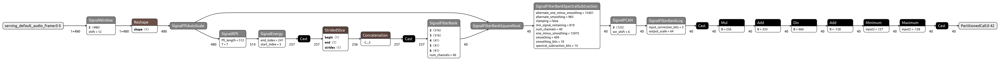
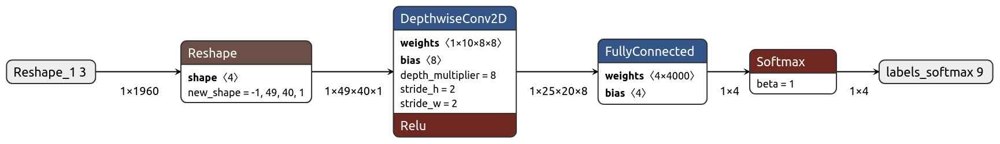

<!-- mdformat off(b/169948621#comment2) -->

# Micro Speech Example

This example shows how to run inference using TensorFlow Lite Micro (TFLM)
on two models for wake-word recognition.
The first model is an audio preprocessor that generates spectrogram data
from raw audio samples.
The second is the Micro Speech model, a less than 20 kB model
that can recognize 2 keywords, "yes" and "no", from speech data.
The Micro Speech model takes the spectrogram data as input and produces
category probabilities.


## Table of contents

-   [Audio Preprocessor](#audio-preprocessor)
-   [Micro Speech Model Architecture](#micro-speech-model-architecture)
-   [Run the C++ tests on a development machine](#run-the-c-tests-on-a-development-machine)
-   [Run the evaluate.py script on a development machine](#run-the-evaluatepy-script-on-a-development-machine)
-   [Run the evaluate_test.py script on a development machine](#run-the-evaluate_testpy-script-on-a-development-machine)
-   [Converting models or audio samples to C++](#converting-models-or-audio-samples-to-c)
-   [Train your own model](#train-your-own-model)

## Audio Preprocessor

### Model Architecture

[](images/audio_preprocessor_int8.png)

*This image was derived from visualizing the 'models/audio_preprocessor_int8.tflite' file in
[Netron](https://github.com/lutzroeder/netron)*

## Micro Speech Model Architecture

This is a simple model comprised of a Convolutional 2D layer, a Fully Connected
Layer or a MatMul Layer (output: logits) and a Softmax layer
(output: probabilities) as shown below. Refer to the [`tiny_conv`](https://github.com/tensorflow/tflite-micro/blob/main/tensorflow/examples/speech_commands/models.py#L673)
model architecture. The output probabilities are in four categories:
`silence`, `unknown`, `yes`, `no`.

[](images/micro_speech_quantized.png)

*This image was derived from visualizing the 'models/micro_speech_quantized.tflite' file in
[Netron](https://github.com/lutzroeder/netron)*

This doesn't produce a highly accurate model, but it's designed to be used as
the first stage of a pipeline, running on a low-energy piece of hardware that
can always be on, and then wake higher-power chips when a possible utterance has
been found, so that more accurate analysis can be done. Additionally, the model
takes in preprocessed speech input as a result of which we can leverage a
simpler model for accurate results.

## Run the C++ tests on a development machine

To compile and test this example on a desktop Linux or macOS machine, download the
[TFLM source code](https://github.com/tensorflow/tflite-micro), and `cd`
into the source directory from a terminal.

Compile and run a native binary using Bazel:
```bash
bazel run tensorflow/lite/micro/examples/micro_speech:micro_speech_test
```

For a native binary using `make`, run the following command:
```bash
make -f tensorflow/lite/micro/tools/make/Makefile test_micro_speech_test
```

For an Arm Cortex-M0 binary running in the QEMU emulator:
```bash
make -f tensorflow/lite/micro/tools/make/Makefile TARGET=cortex_m_qemu TARGET_ARCH=cortex-m0 OPTIMIZED_KERNEL_DIR=cmsis_nn BUILD_TYPE=default test_micro_speech_test
```

This will take a few minutes, and downloads frameworks the code uses like
[CMSIS](https://developer.arm.com/embedded/cmsis) and
[flatbuffers](https://google.github.io/flatbuffers/). Once that process has
finished, you should see a series of files get compiled, followed by some
logging output from a test, which should conclude with `~~~ALL TESTS PASSED~~~`.

If you see this, it means that a small program has been built and run that loads
the trained TensorFlow model, runs some example inputs through it, and got the
expected outputs.

To understand how TensorFlow Lite does this, you can look at the source in the
[micro_speech_test.cc](micro_speech_test.cc) file.
It's a fairly small amount of code that executes the following steps:
1) Create a TFLM `MicroInterpreter` with a handle to the Audio Preprocessor model
that has been compiled into the program
1) Repeatedly execute inference operations using `MicroInterpreter::invoke`,
with audio samples as input, and spectrogram features as output
1) Create a new TFLM `MicroInterpreter` with a handle to the Micro Speech model
that has been compiled into the program
1) Execute a single inference operation using `MicroInterpreter::invoke`,
with the spectrogram features as input, and category probabilities as output
1) Check the largest category probability for a match with the speech sample label.

## Run the evaluate.py script on a development machine
The evaluate.py script runs the hello_world.tflite model with x_values in the 
range of [0, 2*PI]. The script plots a diagram of the predicted value of sinwave
using TFLM interpreter and compare that prediction with the actual value
generated by the numpy lib.

```bash
bazel build tensorflow/lite/micro/examples/micro_speech:evaluate
bazel-bin/tensorflow/lite/micro/examples/micro_speech/evaluate --sample_path=tensorflow/lite/micro/examples/micro_speech/testdata/no_1000ms.wav
```

```bash
Frame #0: [0.0000, 0.0273, 0.0312, 0.9414]
Frame #1: [0.0000, 0.0273, 0.0312, 0.9414]
Frame #2: [0.0000, 0.0273, 0.0312, 0.9414]
Frame #3: [0.0000, 0.0273, 0.0273, 0.9414]
Frame #4: [0.0000, 0.0273, 0.0273, 0.9414]
Frame #5: [0.0000, 0.0273, 0.0273, 0.9414]
Frame #6: [0.0000, 0.0273, 0.0273, 0.9453]
Frame #7: [0.0000, 0.0273, 0.0273, 0.9453]
Frame #8: [0.0000, 0.0273, 0.0273, 0.9453]

...

Frame #40: [0.0000, 0.0312, 0.0000, 0.9648]
Frame #41: [0.0000, 0.0273, 0.0000, 0.9727]
Frame #42: [0.0000, 0.0312, 0.0000, 0.9688]
Frame #43: [0.0000, 0.0273, 0.0000, 0.9727]
Frame #44: [0.0000, 0.0273, 0.0000, 0.9727]
Frame #45: [0.0000, 0.0352, 0.0000, 0.9648]
Frame #46: [0.0000, 0.0391, 0.0000, 0.9609]
Frame #47: [0.0000, 0.0469, 0.0000, 0.9531]
Frame #48: [0.0000, 0.0547, 0.0000, 0.9453]
Model predicts the audio sample as <no> with probability 0.95
```

## Run the evaluate_test.py script on a development machine
These tests verify the input/output as well as the prediction of the
hello_world.tflite model. There is a test to also verify the correctness of
the model by running both TFLM and TFlite interpreter and then comparing the
prediction from both interpreters.
```bash
bazel build tensorflow/lite/micro/examples/micro_speech:evaluate_test
bazel-bin/tensorflow/lite/micro/examples/micro_speech/evaluate_test
```

## Converting models or audio samples to C++
A tool is available to convert your custom model or audio samples into C++ data
structures that you can then use in your own wake-word application.
Keep in mind that audio samples for use with Audio Preprocessor and Micro Speech models
must be 1000ms in length, 16-bit samples, and single channel.
The tool can be found here: [generate_cc_arrays.py](../../tools/generate_cc_arrays.py)

The following commands show how to use the tool:
```bash
bazel build tensorflow/lite/micro/tools:generate_cc_arrays
bazel-bin/tensorflow/lite/micro/tools/generate_cc_arrays /tmp/data.cc path_to_custom_sample.wav
bazel-bin/tensorflow/lite/micro/tools/generate_cc_arrays /tmp/header.cc path_to_custom_sample.wav
```

## Train your own model

So far you have used an existing trained model to run inference on
microcontrollers. If you wish to train your own model, follow the instructions
given in the [train](train/README.md) directory.
